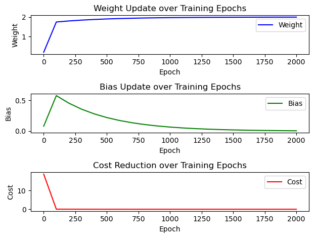

## Pytorch로 선형회귀 구현

## $$ y = a + bx $$

##### 1) 기본 셋팅


```python
import torch
import torch.nn as nn
import torch.nn.functional as F 
import torch.optim as optim
```

##### 2) 변수 선언


```python
x_train = torch.FloatTensor([[1], [2], [3]])
y_label = torch.FloatTensor([[2], [4], [6]])
x_train.shape
```


    torch.Size([3, 1])


##### 3) 가중치(weight)와 bias 초기화


```python
# 가중치 W, a를 0으로 초기화하고 학습을 통해 값이 변경되는 변수임을 명시함.
weight = torch.zeros(1, requires_grad=True) 
bias = torch.zeros(1, requires_grad=True)
```

##### 4) 1차 함수 정의

$$ Y_{pred} = \text{weight} * x + bias $$


```python
y_predict = (weight * x_train) + bias
y_predict
```


    tensor([[0.],
            [0.],
            [0.]], grad_fn=<AddBackward0>)


##### 5) Cost function


```python
cost = torch.mean((y_label-y_predict)**2)
print(cost)
```

    tensor(18.6667, grad_fn=<MeanBackward0>)


##### 6) optimizer 설정


```python
opt = optim.SGD([weight,bias], lr=0.0001)
opt.zero_grad()     # gradient를 항상 0 으로 초기화
cost.backward()     # 비용함수 미분
opt.step()          # weight, bias 업데이트
```

---


```python
# 기본 세팅
import torch
import torch.optim as optim
import matplotlib.pyplot as plt

# 변수선언
x_train = torch.FloatTensor([[1.0], [2.0], [3.0]])
y_label = torch.FloatTensor([[2.0], [4.0], [6.0]])

# 모델 parameter 초기화
weight = torch.tensor(0.0, requires_grad=True) 
bias = torch.tensor(0.0, requires_grad=True)

# Optimizer 설정
learning_rate = 0.01
opt = optim.SGD([weight,bias], lr=learning_rate)

# visualize를 위한 변수설정 
epochs = 2000
epoch_lst = []
weight_lst = []
bias_lst = []
cost_lst = []

# 트레이닝
for epoch in range(epochs+1):
    
    # y 예측값 계산
    y_predict = (weight * x_train) + bias
    
    # 실제 값과의 차이계산(cost)
    cost = torch.mean((y_label-y_predict)**2)
    
    # cost 로 y_predict 개선
    opt.zero_grad()     # gradient를 항상 0 으로 초기화
    cost.backward()     # 비용함수 미분
    opt.step()          # weight, bias 업데이트    

    # 100번 마다 로그 출력
    if epoch % 100 == 0:
        print(f"{epoch= :4,d}   {weight= :5.3f}   {cost= :.6f}")
        epoch_lst.append(epoch)
        weight_lst.append(weight.item())
        bias_lst.append(bias.item())
        cost_lst.append(cost.item())

# weight 그래프
plt.subplot(3, 1, 1)
plt.plot(epoch_lst, weight_lst, label="Weight", color="blue")
plt.xlabel("Epoch")
plt.ylabel("Weight")
plt.title("Weight Update over Training Epochs")
plt.legend()

# Bias 그래프
plt.subplot(3, 1, 2)
plt.plot(epoch_lst, bias_lst, label="Bias", color="green")
plt.xlabel("Epoch")
plt.ylabel("Bias")
plt.title("Bias Update over Training Epochs")
plt.legend()

# Cost 그래프
plt.subplot(3, 1, 3)
plt.plot(epoch_lst, cost_lst, label="Cost", color="red")
plt.xlabel("Epoch")
plt.ylabel("Cost")
plt.title("Cost Reduction over Training Epochs")
plt.legend()

plt.tight_layout()
plt.show()
```

    epoch=    0   weight= 0.187   cost= 18.666666
    epoch=  100   weight= 1.746   cost= 0.048171
    epoch=  200   weight= 1.800   cost= 0.029767
    epoch=  300   weight= 1.843   cost= 0.018394
    epoch=  400   weight= 1.876   cost= 0.011366
    epoch=  500   weight= 1.903   cost= 0.007024
    epoch=  600   weight= 1.924   cost= 0.004340
    epoch=  700   weight= 1.940   cost= 0.002682
    epoch=  800   weight= 1.953   cost= 0.001657
    epoch=  900   weight= 1.963   cost= 0.001024
    epoch= 1,000   weight= 1.971   cost= 0.000633
    epoch= 1,100   weight= 1.977   cost= 0.000391
    epoch= 1,200   weight= 1.982   cost= 0.000242
    epoch= 1,300   weight= 1.986   cost= 0.000149
    epoch= 1,400   weight= 1.989   cost= 0.000092
    epoch= 1,500   weight= 1.991   cost= 0.000057
    epoch= 1,600   weight= 1.993   cost= 0.000035
    epoch= 1,700   weight= 1.995   cost= 0.000022
    epoch= 1,800   weight= 1.996   cost= 0.000013
    epoch= 1,900   weight= 1.997   cost= 0.000008
    epoch= 2,000   weight= 1.997   cost= 0.000005


    

    


```python

```
